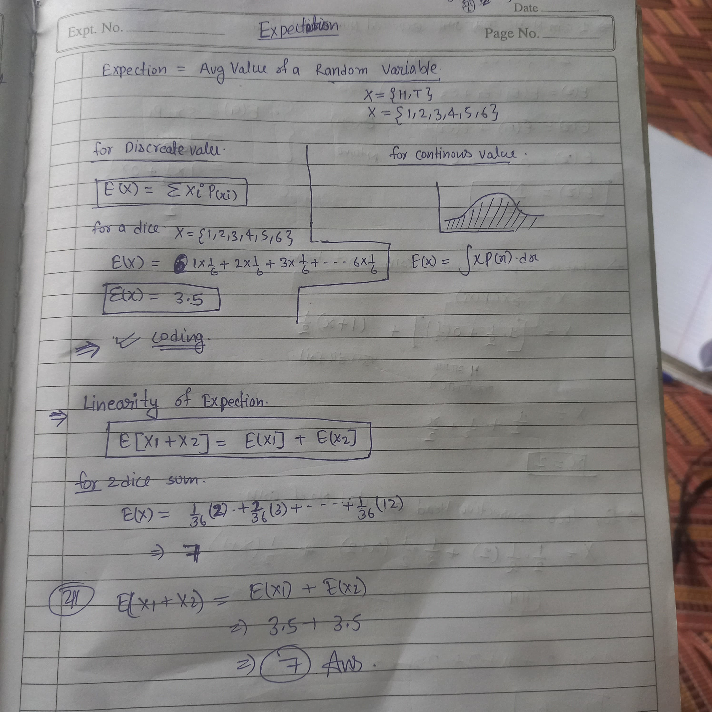
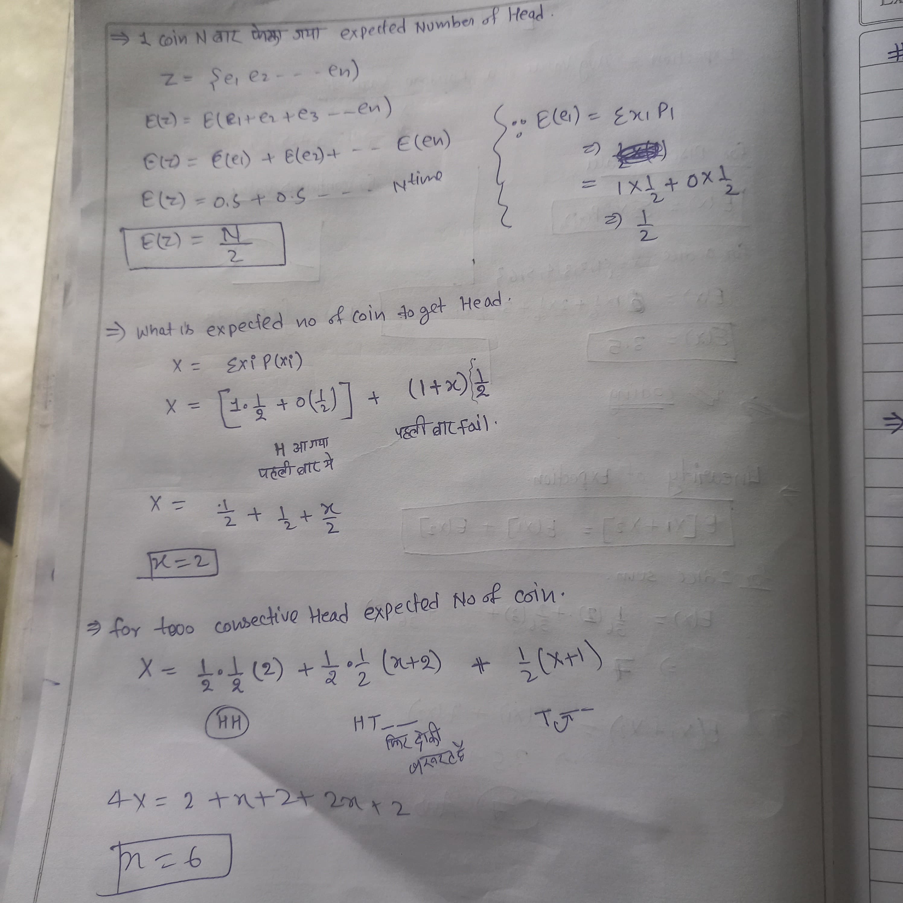
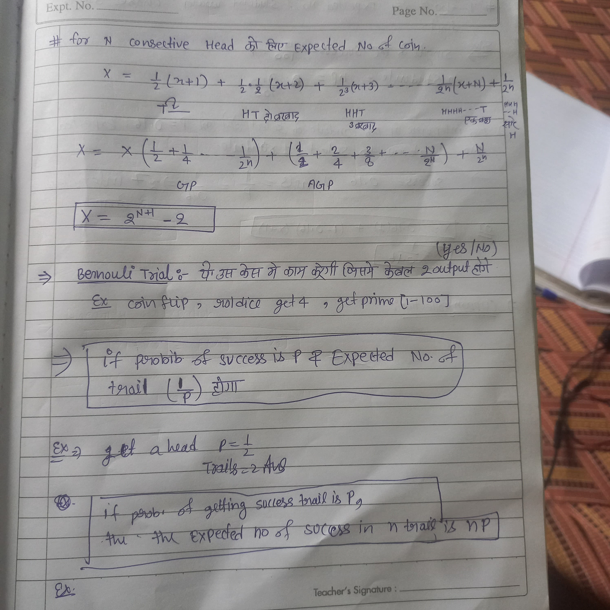
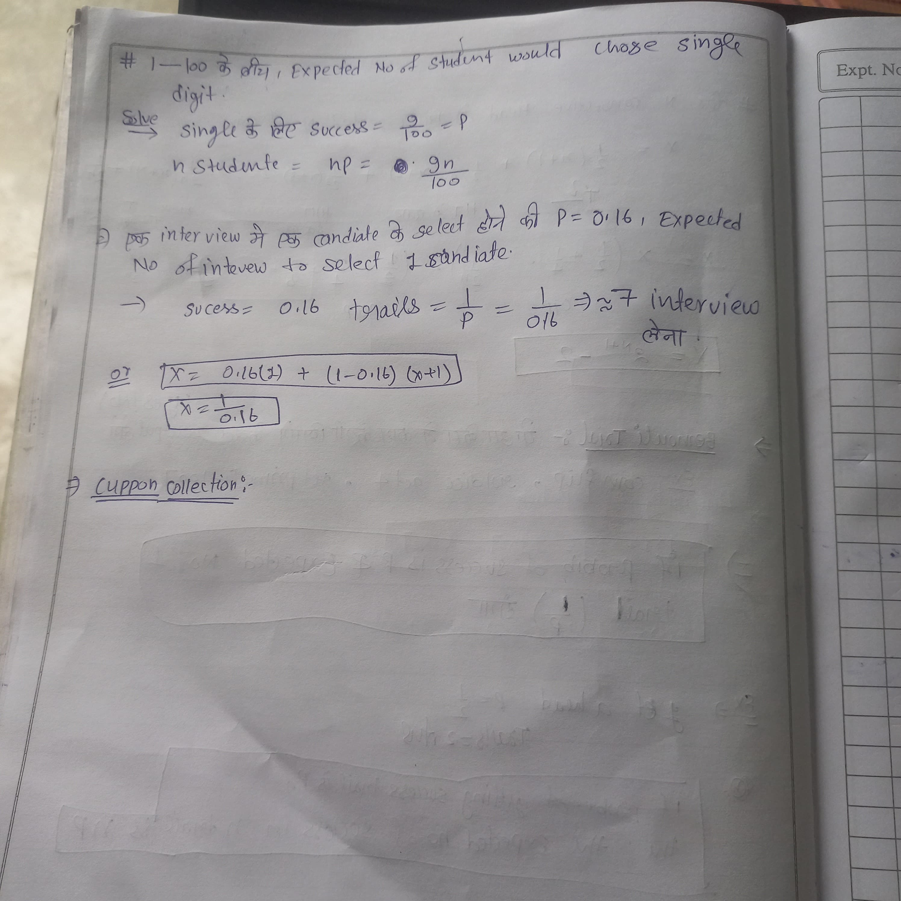

# PigenHole_Expectation
# divisible subset 


```cpp
#include <bits/stdc++.h>
#define int long long int
using namespace std;

void solve() {
    int n;
    cin >> n;
    vector<int> v(n + 1, 0);
    
    for(int i = 1;i <= n;i++) {
        cin >> v[i];
        v[i] += v[i - 1];
        v[i] %= n;
    }
    
    vector<int> mp(n + 1, -1);
    mp[0] = 0;
    
    for(int i = 1;i <= n;i++) {
        if (mp[v[i]] != -1) {
            cout << i - mp[v[i]] << endl;
            for(int j = mp[v[i]] + 1;j <= i;j++) {
                cout << j << " ";
            }
            
            cout << endl;
            return;
        }
        mp[v[i]] = i;
    }

    cout << "-1\n";
}

int32_t main() {
    int t;
    cin >> t;
    
    while(t--) {
        solve();
    }
}
```
# The Garay Simeler code


```cpp
#include <bits/stdc++.h>

using namespace std;

int main() {
    int n;
    cin >> n;
    // stroing 64 bit +ve number
    unsigned long long int arr[n]; // important line
    for (int i = 0; i < n; i++) cin >> arr[i];

    if (n >= 130) {
        cout << "YES\n";
        return 0;
    }

    else {
        for (int i = 0; i < n; i++)
            for (int j = i + 1; j < n; j++)
                for (int k = j + 1; k < n; k++)
                    for (int l = k + 1; l < n; l++)
                        if ((arr[i] ^ arr[j] ^ arr[k] ^ arr[l]) == 0) {
                            cout << "YES\n";
                            return 0;
                        }
        cout << "NO\n";

    }
    return 0;
}
```
# Expectations 





